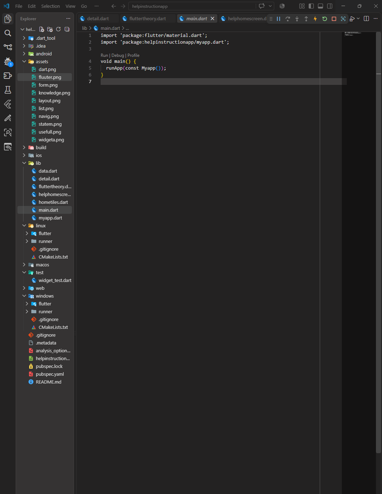
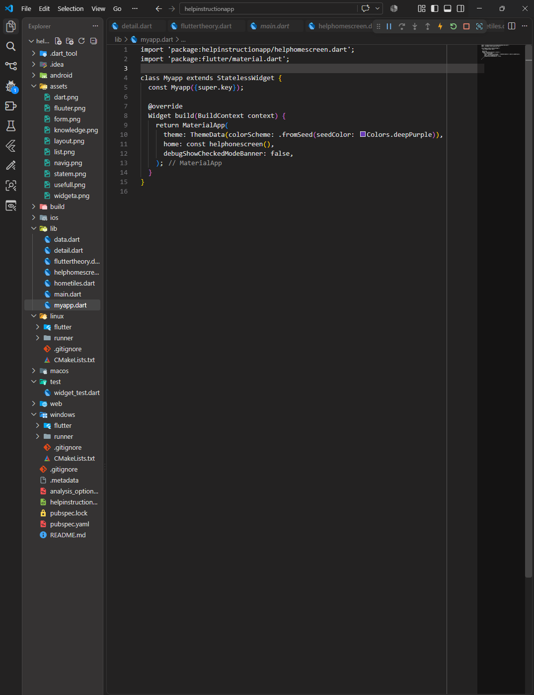
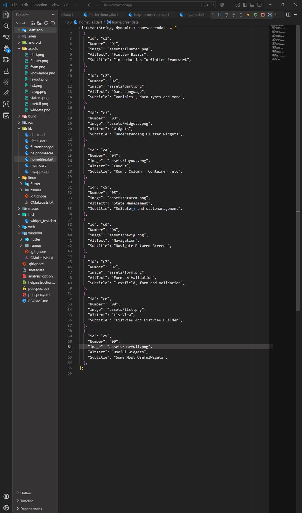
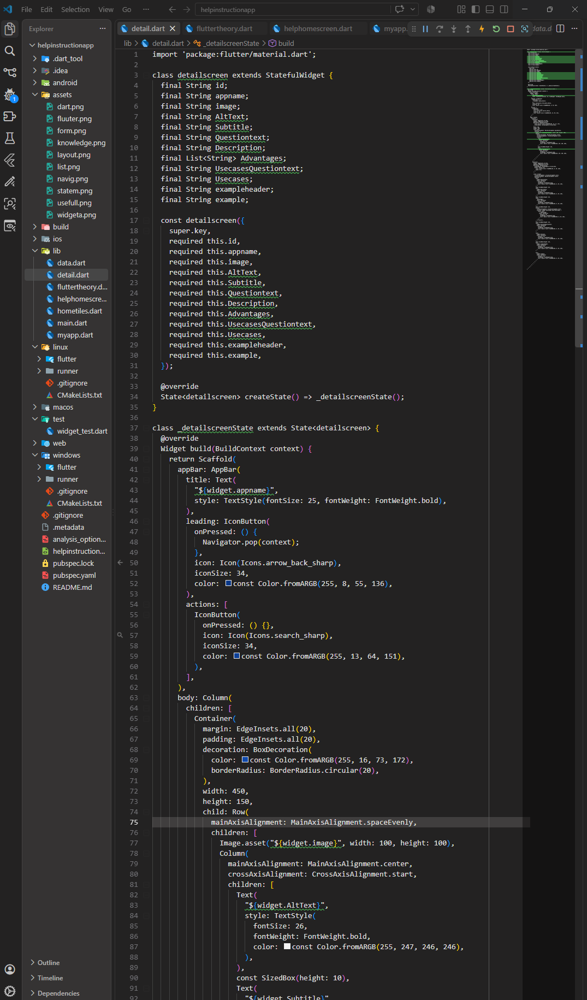
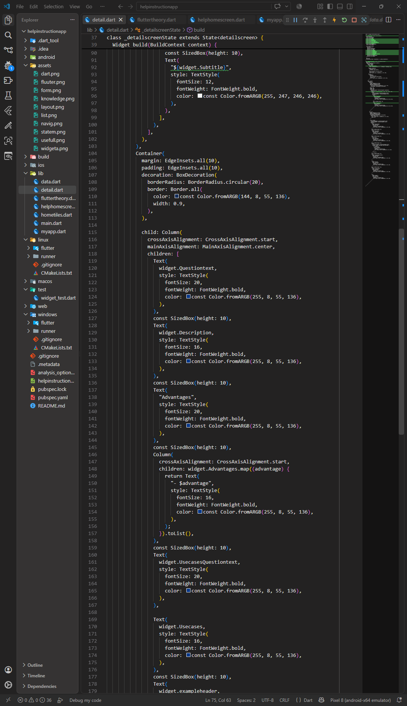
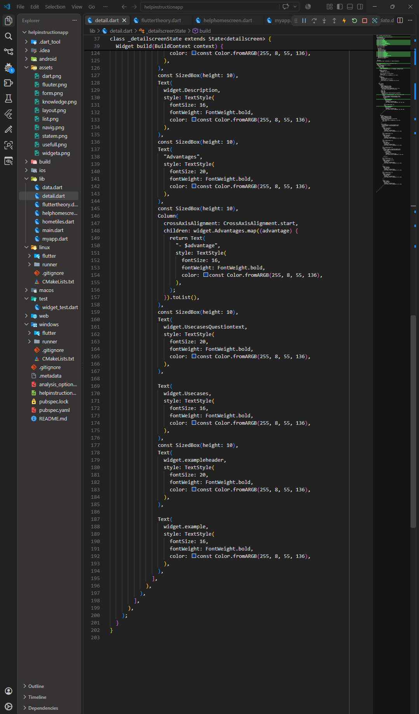
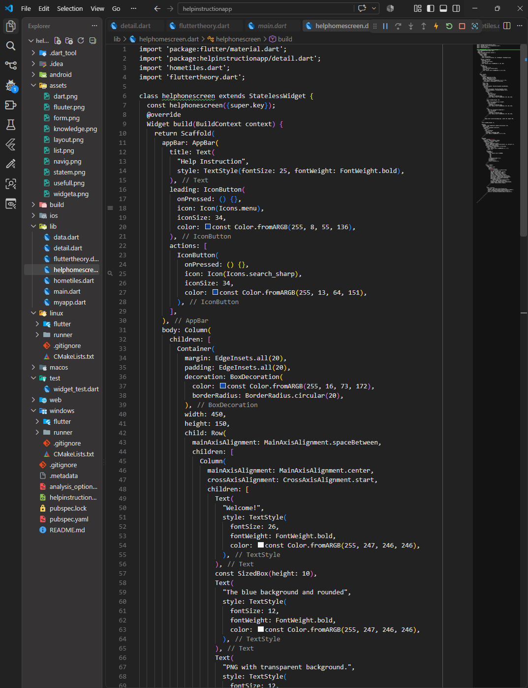
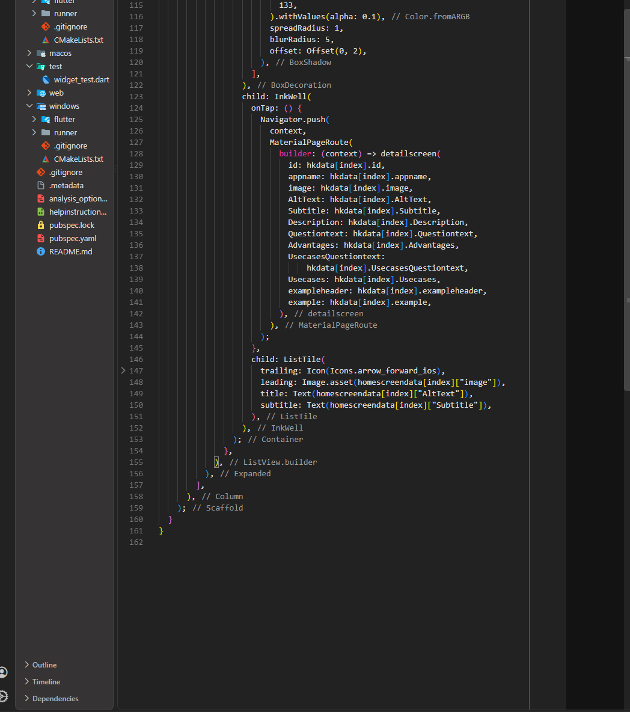

# help-instruction-App
Help Instruction is a Flutter application that provides users with clear and organized guidance about different Flutter concepts. It includes easy-to-understand explanations, key advantages, use cases, examples, and important notes to help beginners learn Flutter step by step.
# Help Instruction App

## Description
Help Instruction is a Flutter application that provides users with clear and organized guidance about different Flutter concepts.

## Screenshots
### Main Dart

### app Dart

### Detail Screen 
### Detail Screen

### Home Screen

### Data Model

### Class and Object

### Final Result

[▶ Watch Demo](helpinstruction.mp4)
